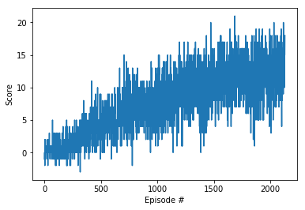

# Report

## Summary

This project implement a Deep Q Network (DQN) as described in this [paper](https://deepmind.com/research/dqn/).<br>
Deep Reinforcement Learning agent will atempt to solve Unity Banana Environment<br>
The Goal of the agent is to pickup yellow bananas while avoiding purple ones

## Environment Info

- `Number of agents: 1`<br>
- `Number of actions: 4`<br>
- `State Length : 37` <br>

## Parameter Values

- MAX_EPISODES: 2500
- MAX_TIMESTEPS_EACH_EPISODE: 1000
- EPSILON_START: 1.0
- EPSILON_MIN: 0.01
- EPSILON_DECAY: 0.999

## Network Info

- Linear Layer:

    - Input Size: Observation Space = 37
    - Output Size: 64
    - Activation: [Rectifier](https://en.wikipedia.org/wiki/Rectifier_(neural_networks))

- Linear Layer 2:

    - Input Size: 64
    - Output Size: 64
    - Activation: [Rectifier](https://en.wikipedia.org/wiki/Rectifier_(neural_networks))

- Linear Output Layer:

    - Input Size: 64
    - Output Size: Action Space = 4


## Scores

```
Episode 100	Average Score: 0.34
Episode 200	Average Score: 0.65
Episode 300	Average Score: 1.09
Episode 400	Average Score: 2.56
Episode 500	Average Score: 3.80
Episode 600	Average Score: 4.61
Episode 700	Average Score: 5.32
Episode 800	Average Score: 6.21
Episode 900	Average Score: 6.99
Episode 1000	Average Score: 7.13
Episode 1100	Average Score: 8.12
Episode 1200	Average Score: 9.33
Episode 1300	Average Score: 9.78
Episode 1400	Average Score: 9.988
Episode 1500	Average Score: 10.41
Episode 1600	Average Score: 11.15
Episode 1700	Average Score: 11.54
Episode 1800	Average Score: 11.93
Episode 1900	Average Score: 11.27
Episode 2000	Average Score: 12.43
Episode 2100	Average Score: 12.42
Episode 2129	Average Score: 13.00
Environment solved in 2029 episodes!	Average Score: 13.00
```





## Future Plans

- Tryout different initial weights to measure impact on training time
- Training more to achieve higher rewards
- Double DQN
- Prioritized Experience Replay
- Policy Based Methods
